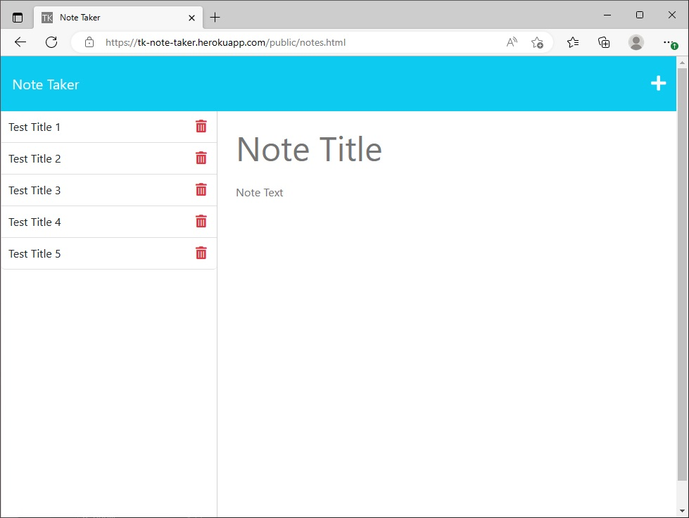

# Bootcamp Module 11 Challenge Assignment -- A "Note Taker" Application

## Description

This current Module 11 Challenge assignment -- a "Note Taker" application -- provided a good mechanism for learning introductory fully-functional API front-end-and-back-end integrated application programming. A large portion and effort of my personal assignment was for a significant attempt to consider about comprehensively assessing about the interconnections of the various systems and inputs and outputs; and the puzzle process of trying to interconnect in a functional way the new code with the provided starter code. The integrations of some additional supplemental imported systems was also involved. Lastly...the new concept and practice and requirement of publishing the finished multiple-part system to an application-hosting website was involved and it required a separate learning requirement and procedural practicing and a methodology developing.

----

The objectives -- user story and acceptance criteria items -- of the assignment were as follows:

[ User Story ]

AS A small business owner

I WANT to be able to write and save notes...SO THAT I can organize my thoughts and keep track of tasks I need to complete.

[ Acceptance Criteria ]

GIVEN a note-taking application...

WHEN I open the Note Taker...THEN I am presented with a landing page with a link to a notes page.

WHEN I click on the link to the notes page...THEN I am presented with a page with existing notes listed in the left-hand column, plus empty fields to enter a new note title and the note’s text in the right-hand column.

WHEN I enter a new note title and the note’s text...THEN a Save icon appears in the navigation at the top of the page.

WHEN I click on the Save icon...THEN the new note I have entered is saved and appears in the left-hand column with the other existing notes.

WHEN I click on an existing note in the list in the left-hand column...THEN that note appears in the right-hand column.

WHEN I click on the Write icon in the navigation at the top of the page...THEN I am presented with empty fields to enter a new note title and the note’s text in the right-hand column.

....

[ Additional Grading Criteria ]

Also good coding practices and good GitHub/Git repository configuration.

Bonus (COMPLETED): Have a note deletion functionality.

## Installation

Make sure that you have a GitHub membership and account to be able to view the repository of the assignment webpage system. The published GitHub Pages view of the website should be accessible on the public internet access URL without a need to have a GitHub membership/account.

If the repository is being cloned to a grading computer for separate review/usage...then use the "npm i" command from the console of the local clone directory.

## Usage

To use this application/webpage...

1. Click the buttons and view the displayed information and respond to it as-necessary.

2. Enter some notes.

3. View some existing notes.

4. Delete some/all existing notes.

5. Enter some more notes.

The following picture shows the appearance of the upgraded webpage:

The following URL is for the GitHub Pages published static-view public view of Todd Kridel's Coding Bootcamp Module Challenge assignment webpage...which shows only the non-server (non-backend) view of the application: "https://todd-kridel.github.io/TK-Note-Taker". The fully-functional front-end and back-end (with-server) version of the application is published at the Heroku application-hosting webpage system at URLs "https://tk-note-taker.herokuapp.com/public/index.html" and "https://tk-note-taker.herokuapp.com/public/notes.html".

## Credits

Starter code was provided by the Bootcamp-related public GitHub repository that has the following contributors:

Note Taker Starter Code
coding-boot-camp / miniature-eureka
Public
Starter Code: git@github.com:coding-boot-camp/miniature-eureka.git

Contributors" 3
@Xandromus; Xandromus Xander Rapstine
@nol166; nol166 John McCambridge
@Georgeyoo; Georgeyoo George

## License

MIT License

Copyright (c) 2022 DU Full-Stack Web Development Coding Boot Camp

Permission is hereby granted, free of charge, to any person obtaining a copy
of this software and associated documentation files (the "Software"), to deal
in the Software without restriction, including without limitation the rights
to use, copy, modify, merge, publish, distribute, sublicense, and/or sell
copies of the Software, and to permit persons to whom the Software is
furnished to do so, subject to the following conditions:

The above copyright notice and this permission notice shall be included in all
copies or substantial portions of the Software.

THE SOFTWARE IS PROVIDED "AS IS", WITHOUT WARRANTY OF ANY KIND, EXPRESS OR
IMPLIED, INCLUDING BUT NOT LIMITED TO THE WARRANTIES OF MERCHANTABILITY,
FITNESS FOR A PARTICULAR PURPOSE AND NONINFRINGEMENT. IN NO EVENT SHALL THE
AUTHORS OR COPYRIGHT HOLDERS BE LIABLE FOR ANY CLAIM, DAMAGES OR OTHER
LIABILITY, WHETHER IN AN ACTION OF CONTRACT, TORT OR OTHERWISE, ARISING FROM,
OUT OF OR IN CONNECTION WITH THE SOFTWARE OR THE USE OR OTHER DEALINGS IN THE
SOFTWARE.

